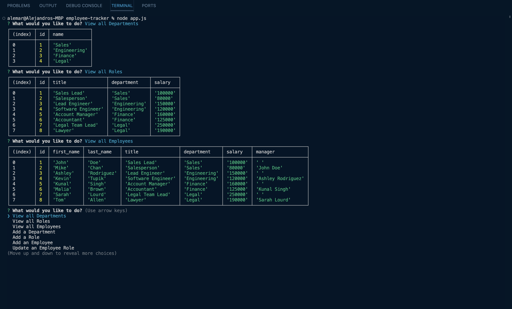

# Employee Tracker

## Description
This project was built for a hypothetical business owner, wanting an application
to be able to view and manage departments, roles, and employees in their company.
It requires the ability to create a database and be able to change the data within.

## Built with
- Node JS
- PostgreSQL Database
- Inquirer ( npm package )
- pg ( npm package )

## Links
[Link to Video Demo](https://www.loom.com/share/aaa6d5a69b8a4acd81ae5447e8dc788a?sid=b95e4245-c7fb-40a1-9c5c-f3ca5af8df02)

## Screenshot
